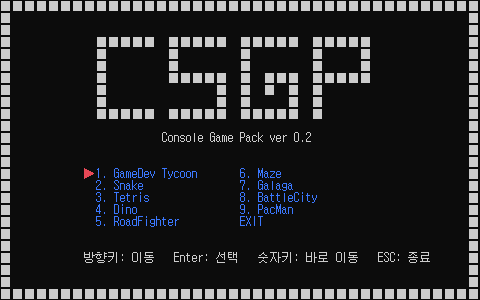
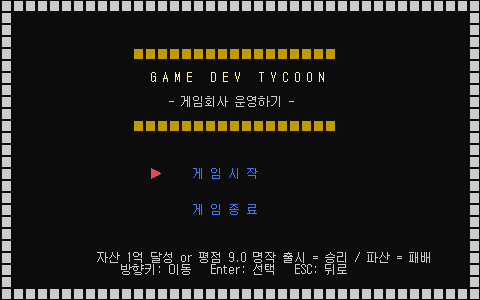
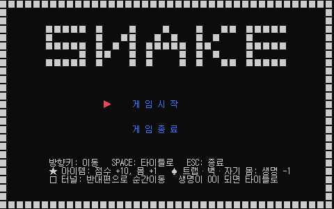
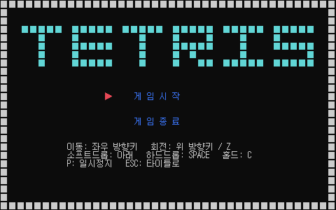
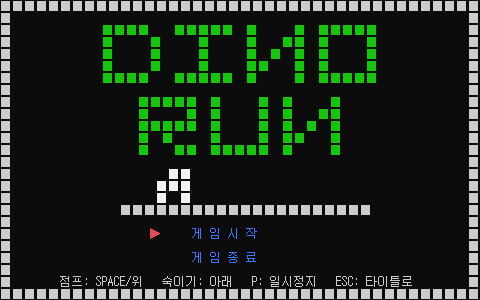
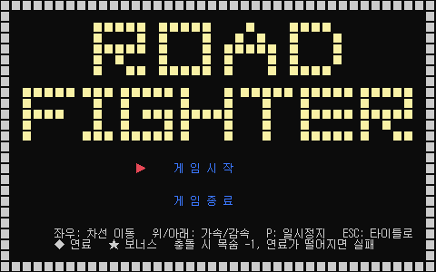
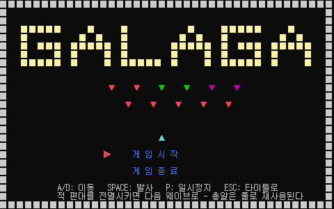
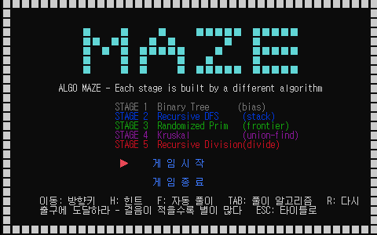
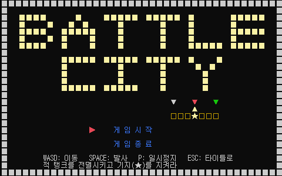
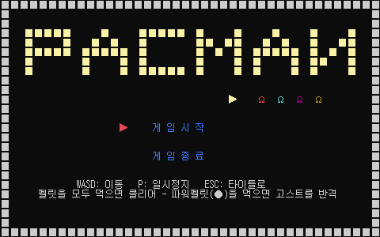

<div align="center">



# CSGP — Console Game Pack

**Windows 콘솔(Win32 API) 위에서 동작하는 C++ 게임 프레임워크와 그 위에서 만든 게임 9종**


</div>

---

## 소개

**CSGP(Console Game Pack)** 는 단순한 게임 모음이 아니라, **엔진(프레임워크)과 콘텐츠(게임)를 분리한 계층형 설계** 위에서 게임을 하나씩 쌓아 올리며 개발 기술을 단계적으로 익히는 학습형 프로젝트입니다.

- **프레임워크 우선** — 모든 게임이 공유하는 토대(게임 루프·렌더링·입력·타이머·씬)를 먼저 만들고, 게임은 그 위에서 자기 로직에만 집중합니다.
- **콘솔의 제약을 정공법으로** — 더블 버퍼링, 전각 문자 2칸, 타이머 해상도(10~16ms), CP949 인코딩 같은 콘솔 특유의 문제를 회피하지 않고 다룹니다.
- **하나의 게임 = 하나의 학습 단계** — 자료구조 → 알고리즘 → 물리 → 시스템 → 메모리·성능 → 종합으로 난이도가 단조 증가합니다.

> 상세 설계는 **[기술 문서 (CSGP Architecture)](Release_Docs/CSGP_Architecture.md)** 를 참고하세요.

---

## 게임 목록

<table>
  <tr>
	<td align="center"><br/><b>Game Dev Tycoon</b><br/><sub>경영 시뮬레이션</sub></td>
    <td align="center"><br/><b>Snake</b><br/><sub>동적 자료구조·충돌</sub></td>
    <td align="center"><br/><b>Tetris</b><br/><sub>그리드·회전 알고리즘</sub></td>
  </tr>
  <tr>
	<td align="center"><br/><b>Dino</b><br/><sub>물리·월드 스크롤</sub></td>
    <td align="center"><br/><b>Road Fighter</b><br/><sub>엔티티 시스템·리소스</sub></td>
    <td align="center"><br/><b>Galaga</b><br/><sub>오브젝트 풀링</sub></td>
  </tr>
  <tr>
	<td align="center"><br/><b>Maze</b><br/><sub>맵 생성·경로탐색</sub></td>
    <td align="center"><br/><b>Battle City</b><br/><sub>생성+풀링 종합</sub></td>
    <td align="center"><br/><b>Pac-Man</b><br/><sub>성격별 AI·FSM</sub></td>
  </tr>
</table>

| # | 게임 | 처음 배우는 핵심 기술 | 조작 |
|:---:|---|---|---|
| 1 | **Game Dev Tycoon** | 턴제 경영 시뮬레이션 (C 문법 학습용을 씬으로 이식) | 방향키 · Enter |
| 2 | **Snake** | 동적 자료구조(`vector`+포인터), 충돌, 상태머신 | 방향키 이동 · SPACE 타이틀 |
| 3 | **Tetris** | 2D 그리드, SRS 회전/월킥, 라인 클리어, 7-bag, DAS | ←→ 이동 · ↑/Z 회전 · SPACE 하드드롭 · C 홀드 |
| 4 | **Dino** | 물리(중력/점프), 월드 스크롤, AABB, 스프라이트 | SPACE/↑ 점프 · ↓ 숙이기 |
| 5 | **Road Fighter** | 엔티티 시스템, 리소스(연료/목숨), 시간 기반 스테이지 | ←→ 차선 · ↑↓ 가속/감속 |
| 6 | **Galaga** | 오브젝트 풀링(`Pool<T,N>`), 대량 오브젝트 | A/D 이동 · SPACE 발사 |
| 7 | **Maze** | 맵 생성 5종 + 경로탐색 4종, union-find, 분할정복 | 방향키 · H 힌트 · F 자동풀이 · TAB 알고리즘 |
| 8 | **Battle City** | 맵 생성 + 풀링 결합, 파괴 지형, 적 AI (종합 캡스톤) | WASD 이동 · SPACE 발사 |
| 9 | **Pac-Man** | 성격별 타게팅 AI, 유한상태기계(FSM) | WASD 이동 |


> 공통: 인게임 `P` 일시정지, `ESC` 타이틀로. 허브에서 방향키/Enter로 게임 선택, 숫자키로 바로 이동, `ESC` 종료. 씬 전환 시 **로딩 화면**을 경유합니다.

---

## 아키텍처 요약

```
main.cpp                진입점: 매니저 OnInit → 게임 루프 → 역순 해제
framework.h             공용 헤더: 싱글턴 매크로 · 색상 상수 · GAME_SIZE(40x25) · 씬 enum

FrameWork/              ── 엔진 계층 (모든 게임이 공유) ──────────────
  singleton.h             템플릿 싱글턴
  ScreenManager           콘솔 버퍼 2개로 더블 버퍼링 (+ 논리좌표 DrawCell)
  TimerManager            GetTickCount64 기반 틱 타이머 · 프레임 제한
  InputManager            GetAsyncKeyState 폴링 (엣지/레벨 입력)
  SceneManager            씬 등록·전환·소유 (+ 로딩 경유 전환)
  Interface/IContent      씬 인터페이스 (OnInit/Release/Update/Render)
  UI/TextUtil             Pad · Comma · Center (공용 텍스트 유틸)
  Render/RenderUtil       DrawSpriteRows · DrawGauge · DrawBorder
  Render/Glyph.h          전각 글리프 상수 (CP949 바이트, ASCII 안전)
  Object/Pool.h           고정 크기 오브젝트 풀 Pool<T,N>

Main/                   ── 콘텐츠 계층 (게임) ──────────────────────
  MainContent             씬 등록·시작 씬 선택, 외곽 테두리
  Content/Interface/IGameContent   IContent + TITLE/INGAME 페이즈 상태머신
  Content/*Content        게임 9종 + Intro/Title(허브)/Load 씬
```

**핵심 설계**

- **게임 루프**: `입력 → Update → Render → FlippingBuffer → 프레임 대기(≈60fps)` 고정 루프
- **씬 시스템**: `SceneManager`가 `map<int, IContent*>`로 씬을 소유·전환하며, 전환 시 이전 씬 `OnRelease()` → 새 씬 `OnInit()`
- **로딩 시퀀스**: `ChangeContentWithLoading(load, next)` — 목적지를 예약(Reserve)해 두고 로딩 씬을 거친 뒤 예약된 씬으로 진입
- **좌표계**: 논리 해상도 40×25. 전각 1글자 = 콘솔 2칸이므로 **출력 시 x×2** (게임 로직은 논리 좌표로만 계산)

> 매니저·씬·생명주기·콘솔 제약에 대한 상세는 **[기술 문서](Release_Docs/CSGP_Architecture.md)** 에 정리되어 있습니다.

---

## 다운로드

바로 실행할 수 있는 **단일 실행 파일**(정적 링크, 별도 런타임 설치 불필요)을 내려받을 수 있습니다.

- **[⬇ CSGP.zip 다운로드](dist/CSGP.zip)** — 압축을 풀고 `CSGP.exe` 실행 (Windows x64)

> Visual C++ 재배포 패키지 없이 어느 Windows에서나 실행됩니다. 콘솔 창에서 실행하세요. `ESC` 로 종료.

---

## 빌드 & 실행

Windows 전용입니다 (Win32 콘솔 API 직접 사용). Visual Studio 또는 MSBuild로 빌드합니다.

```powershell
# MSBuild 위치 탐색
$msbuild = & "${env:ProgramFiles(x86)}\Microsoft Visual Studio\Installer\vswhere.exe" `
  -latest -products * -requires Microsoft.Component.MSBuild -find MSBuild\**\Bin\MSBuild.exe

# 빌드 (Debug|x64)
& $msbuild CSGP.sln /p:Configuration=Debug /p:Platform=x64 /m

# 실행 (결과물)
.\x64\Debug\CSGP.exe
```

> 콘솔 게임이므로 실제 콘솔 창에서 실행해야 합니다 (파이프로 실행하면 스크린 버퍼가 동작하지 않음). `ESC` 로 종료합니다.

---

## 학습 커리큘럼

CSGP는 두 부로 나뉜 학습 트랙을 따라 성장합니다.

- **1부 — C 기본 문법** : 표준 C만으로 만든 턴제 경영 시뮬레이션 **Game Dev Tycoon** (변수 → 파일 분리까지 15단계) — 지금은 게임 씬 `TycoonContent`로 이식되어 게임 팩에 수록
- **2부 — C++ 콘솔 게임 팩** : 엔진(0단계) → Snake → Tetris → Dino → Road Fighter → Galaga → Maze → Battle City

---

## 문서

| 문서 | 내용 |
|---|---|
| **[Release_Docs/CSGP_Architecture.md](Release_Docs/CSGP_Architecture.md)** | 프레임워크 기술 문서 (아키텍처·매니저·콘솔 제약) |

---

## 주의: 소스 인코딩

모든 `.cpp`/`.h` 소스는 **CP949(EUC-KR)** 로 저장되어 있습니다. 한글 주석과 전각 문자열 리터럴이 콘솔에 그대로 출력되기 때문입니다. 에디터로 수정할 때는 **반드시 CP949로 저장**해야 하며, UTF-8로 저장하면 한글이 깨집니다. 자세한 내용은 기술 문서의 인코딩 절 **[Release_Docs/CSGP_Architecture.md](Release_Docs/CSGP_Architecture.md)** 을 참고하세요.

---

<div align="center"><sub>CSGP — Console Game Pack · C++17 · Win32 Console API</sub></div>
