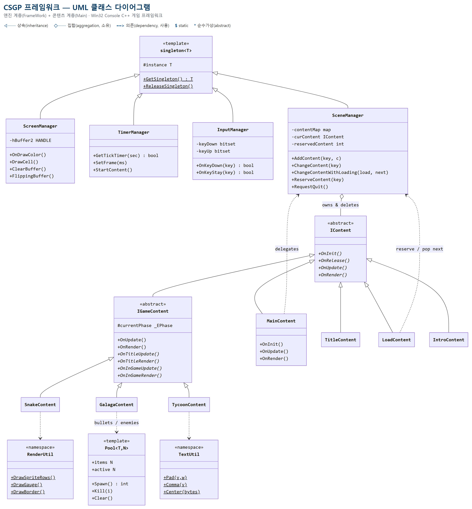

# CSGP 프레임워크 기술 문서

**Console Game Pack — Win32 콘솔 기반 C++ 게임 프레임워크 아키텍처**

| 항목 | 내용 |
|------|------|
| 프로젝트 | CSGP (Console Game Pack) |
| 언어 / 표준 | C++17 |
| 플랫폼 | Windows (Win32 Console API 직접 사용) |
| 빌드 | MSBuild / Visual Studio, Debug\|x64 |
| 구성 | 엔진 계층 `FrameWork/` + 콘텐츠 계층 `Main/` |
| 게임 | 9종 (Snake · Tetris · Dino · Road Fighter · Galaga · Maze · Battle City · Pac-Man · Tycoon) |

---

## 1. 프로젝트 개요

CSGP는 **Windows 콘솔 API만으로 실시간 게임을 구동하는 C++ 프레임워크**와, 그 위에서 동작하는 게임 콘텐츠를 함께 개발하는 프로젝트다. 설계의 중심 원칙은 하나다 — **엔진(여러 게임이 공유하는 토대)과 콘텐츠(개별 게임 로직)를 분리한다.**

- **프레임워크 우선**: 게임 루프·렌더링·입력·타이머·씬 관리라는 공통 토대를 `FrameWork/`에 두고, 게임은 그 위에서 자기 고유 로직만 구현한다.
- **콘텐츠는 씬으로**: 모든 화면/게임은 `IContent`(또는 `IGameContent`)를 상속한 씬 클래스이며 `SceneManager`에 등록된다.
- **콘솔 제약의 내재화**: 더블 버퍼링, 전각 문자 폭, 타이머 해상도, 인코딩 같은 콘솔 특유의 문제를 프레임워크 계층에서 흡수해, 게임 코드가 이를 의식하지 않도록 한다.

이 문서는 프레임워크의 구조와 설계 결정을 정리한 기술 명세다. 게임별 설계는 각 GDD, 학습 경로는 커리큘럼 문서를 참고한다.

---

## 2. 계층 구조

프로젝트는 두 계층으로 나뉜다. 의존 방향은 **콘텐츠 → 엔진** 단방향이며, 엔진은 특정 게임을 알지 못한다.

```
+===================================================================+
|  Main/  ── 콘텐츠 계층 (게임)                                      |
|                                                                   |
|   MainContent ── 씬 등록 · 시작 씬 선택 · 외곽 테두리              |
|   Content/                                                        |
|     Interface/IGameContent ── TITLE / INGAME 페이즈 상태머신       |
|     SnakeContent · TetrisContent · ... · TycoonContent (게임 9종)  |
|     IntroContent · TitleContent(허브) · LoadContent(로딩)          |
+-------------------------------- ▲ --------------------------------+
                                  │  (콘텐츠가 엔진을 사용)
+-------------------------------- │ --------------------------------+
|  FrameWork/  ── 엔진 계층 (모든 게임이 공유)                       |
|                                                                   |
|   singleton.h            템플릿 싱글턴                             |
|   ScreenManager          더블 버퍼링 · OnDraw / OnDrawColor / DrawCell |
|   TimerManager           틱 타이머 · 프레임 제한                   |
|   InputManager           폴링 입력 (엣지 / 레벨)                   |
|   SceneManager           씬 등록 · 전환 · 소유 · 로딩 경유 전환    |
|   Interface/IContent     씬 인터페이스 (순수가상 + 가상 소멸자)    |
|   UI/TextUtil            Pad · Comma · Center                     |
|   Render/RenderUtil      DrawSpriteRows · DrawGauge · DrawBorder  |
|   Render/Glyph.h         전각 글리프 상수 (CP949 바이트)          |
|   Object/Pool.h          고정 크기 오브젝트 풀 Pool<T,N>          |
+===================================================================+

  framework.h ── 공용 헤더: 싱글턴 접근 매크로 · 색상 상수 ·
                 GAME_SIZE(40x25) · 씬 식별 enum _ECONTENT
```

`framework.h`는 전 계층이 include하는 공용 헤더로, 매니저 싱글턴 접근 매크로(`SCREEN`/`TIMER`/`INPUT`/`SCENE`), 16색 상수, 논리 해상도 `GAME_SIZE_X(40) × GAME_SIZE_Y(25)`, 씬 식별 enum `_ECONTENT`를 정의한다.

### 클래스 다이어그램 (UML)

주요 클래스와 관계를 UML 클래스 다이어그램으로 정리하면 다음과 같다. 매니저 4종은 `singleton<T>`를, 게임 씬은 `IGameContent`를, 그 밖의 씬(허브·로딩·인트로)은 `IContent`를 상속한다. `SceneManager`는 등록된 씬을 **소유(◇)** 하고, 콘텐츠는 공용 유틸을 **사용(⇢)** 한다.



---

## 3. 게임 루프와 생명주기

### 3.1 진입점과 메인 루프

`main.cpp`는 매니저를 초기화하고, 고정 게임 루프를 돌린 뒤, 역순으로 해제한다.

```cpp
SCREEN->OnInit();  TIMER->OnInit();  INPUT->OnInit();  SCENE->OnInit();

MainContent* main = new MainContent();
main->OnInit();

while (gameState)
{
    SCREEN->ClearBuffer();          // 뒷 버퍼 지우기
    main->OnUpdate();               // 입력 반영 + 상태 갱신

    if (INPUT->OnKeyDown(VK_ESCAPE)) break;   // 씬이 소비하지 않은 ESC = 종료
    if (SCENE->IsQuitRequested())   break;    // 메뉴 EXIT 로 요청된 종료

    main->OnRender();               // 뒷 버퍼에 그리기
    SCREEN->FlippingBuffer();       // 앞/뒤 버퍼 교체 (표시)
    TIMER->SetFrame(1000.0f / 60.0f);         // 프레임 대기 (≈60fps)
}
main->OnRelease();  delete main;    // 콘텐츠 해제
// 매니저 역순 해제 (Scene → Input → Timer → Screen)
```

루프의 한 바퀴는 **`ClearBuffer → 입력·Update → Render → FlippingBuffer → 프레임 대기`** 로 고정되어 있다. 이것이 모든 실시간 게임의 심장이며, 게임은 이 루프에 손대지 않고 자기 씬의 `OnUpdate`/`OnRender`만 채운다.

### 3.2 씬 생명주기

씬 전환(`SCENE->ChangeContent`)이 일어나면 이전 씬의 `OnRelease()`가 호출되고, 새 씬의 `OnInit()`이 호출된다. 이 규칙에서 두 가지 관례가 나온다.

- **멤버 초기화는 생성자가 아니라 `OnInit`에서** 한다. 씬은 한 번 생성된 뒤 여러 번 재진입될 수 있고, 재진입 시 다시 불리는 곳은 `OnInit`뿐이기 때문이다.
- **`OnRelease()`는 두 번 불려도 안전**해야 한다 (씬 전환 시 한 번, 프로그램 종료 시 한 번).

---

## 4. 매니저 4종

모든 매니저는 템플릿 싱글턴을 상속한다. `framework.h`가 접근 매크로를 제공한다.

```cpp
#define SCREEN ScreenManager::GetSingleton()
#define TIMER  TimerManager::GetSingleton()
#define INPUT  InputManager::GetSingleton()
#define SCENE  SceneManager::GetSingleton()
```

### 4.1 singleton&lt;T&gt; — 템플릿 싱글턴

CRTP 형태로, 파생 매니저마다 정적 인스턴스를 하나만 유지한다. C++ 템플릿과 정적 멤버의 입문 예제이기도 하다.

```cpp
template <typename T>
class singleton {
protected:
    static T* instance;
public:
    static T* GetSingleton() { if (!instance) instance = new T; return instance; }
    void ReleaseSingleton() { if (instance) { delete instance; instance = 0; } }
};
template <typename T> T* singleton<T>::instance = 0;
```

### 4.2 ScreenManager — 더블 버퍼링

콘솔 스크린 버퍼(`hBuffer[2]`) 두 개를 번갈아 사용해 깜빡임 없이 화면을 그린다. 게임은 뒷 버퍼에 그리고(`OnDraw`/`OnDrawColor`), `FlippingBuffer()`로 앞뒤를 교체한다.

| 함수 | 역할 |
|------|------|
| `OnDraw(x, y, msg)` | 문자열 출력 (콘솔 원좌표) |
| `OnDrawColor(x, y, msg, color, bg=255)` | 색상 지정 출력. `bg` 생략(255) 시 기존 배경 유지 |
| `DrawCell(lx, y, glyph, color, bg=255)` | **논리좌표** 출력 — 내부에서 `x*2` 변환을 대신 처리 |
| `ClearBuffer` / `FlippingBuffer` | 뒷 버퍼 지우기 / 앞뒤 버퍼 교체 |

색은 `framework.h`의 16색 상수(`BLACK`~`WHITE`, 0~15)만 사용한다. 콘솔 API 호출은 비싸므로, 셀 단위 호출을 남발하기보다 가능하면 문자열 단위로 묶어 그린다.

### 4.3 TimerManager — 틱 타이머와 프레임 제한

`GetTickCount64()`(해상도 10~16ms) 기반이다.

- `GetTickTimer(sec)` — "sec초마다 true"를 반환하는 틱 타이머. 이동·애니메이션 주기 제어에 쓴다.
- `SetFrame(ms)` — 지난 프레임에서 `ms`가 안 지났으면 `Sleep`으로 채워 프레임률을 고정한다.
- `StartContent()` — 씬 진입 시 기준 시각을 리셋한다.

### 4.4 InputManager — 폴링 입력

`GetAsyncKeyState`를 매 프레임 폴링하고, `bitset<256>`으로 이전 상태를 기억해 엣지/레벨을 구분한다.

| 함수 | 의미 |
|------|------|
| `OnKeyDown(key)` | 눌린 **순간** 한 번 true (엣지) |
| `OnKeyUp(key)` | 뗀 순간 한 번 true |
| `OnKeyStay(key)` | 눌려 있는 **동안** 계속 true (레벨) |

메뉴 이동·발사처럼 한 번만 반응할 입력은 `OnKeyDown`, 연속 이동은 `OnKeyStay`를 쓴다.

### 4.5 SceneManager — 씬 등록·전환·소유

`map<int, IContent*>`로 씬을 보관한다. **등록된 모든 씬의 소유권을 가지며** `OnRelease()`에서 `delete`한다. 씬을 `new`해서 `AddContent`에 넘긴 뒤에는 외부에서 삭제하지 않는다.

```cpp
void SceneManager::ChangeContent(int key) {
    if (curContent) curContent->OnRelease();   // 이전 씬 해제
    if (contentMap.count(key)) {
        curContent = contentMap[key];
        curContent->OnInit();                   // 새 씬 초기화
    }
}
```

프로그램 종료 통로도 여기 있다. 메뉴의 EXIT 항목은 `RequestQuit()`로 종료를 예약하고, 메인 루프가 `IsQuitRequested()`를 폴링해 루프를 정상적으로 빠져나간다(강제 종료가 아니라 매니저 해제까지 수행).

---

## 5. 씬 시스템

### 5.1 IContent — 씬 인터페이스

모든 씬의 공통 계약. 순수가상 4개와 가상 소멸자로 구성된다.

```cpp
class IContent abstract {
public:
    virtual ~IContent() = default;
    virtual void OnInit()   = 0;
    virtual void OnRelease()= 0;
    virtual void OnUpdate() = 0;
    virtual void OnRender() = 0;
};
```

### 5.2 IGameContent — 페이즈 상태머신

대부분의 게임은 "타이틀 화면 ↔ 인게임"이라는 공통 구조를 가진다. `IGameContent`는 `IContent`를 상속해 이 페이즈를 표준화한다.

```cpp
class IGameContent : public IContent {
public:
    enum class _EPhase { NONE, TITLE, INGAME };
protected:
    _EPhase currentPhase = _EPhase::NONE;
public:
    void OnUpdate() override;   // 페이즈에 따라 OnTitleUpdate / OnInGameUpdate 로 분기
    void OnRender() override;   // 페이즈에 따라 OnTitleRender / OnInGameRender 로 분기

    virtual void OnTitleUpdate()  = 0;   virtual void OnTitleRender()  = 0;
    virtual void OnInGameUpdate() = 0;   virtual void OnInGameRender() = 0;
};
```

게임은 이 네 개의 훅만 채우고, 게임 고유의 세부 상태(예: `READY`/`PLAYING`/`GAMEOVER`)는 각자 내부 enum으로 얹는다. 1단계 이후 모든 게임이 이 구조를 재사용한다.

### 5.3 소유권 규칙 정리

- `SceneManager`가 등록된 씬을 소유·해제한다.
- 씬은 자기가 `new`한 게임 오브젝트를 자신의 `OnRelease()`에서 해제한다.
- 힙 멤버를 가진 파생 클래스는 `IContent`의 가상 소멸자 체계를 유지한다.

---

## 6. 씬 전환과 로딩 시퀀스

씬 A에서 B로 갈 때 로딩 화면(`LoadContent`)을 경유하려면, **"로딩이 끝났을 때 어디로 갈지"** 를 누군가 기억해야 한다. 이 책임은 씬 전환의 주인인 `SceneManager`가 진다 — "예약(reservation)" 패턴이다.

```cpp
// SceneManager
void ReserveContent(int key)      { reservedContent = key; }
int  PeekReservedContent()        { return reservedContent; }        // 소모 안 함 (배너 표시용)
int  PopReservedContent()         { int k = reservedContent; reservedContent = -1; return k; }
void ChangeContentWithLoading(int loadKey, int key) {
    ReserveContent(key);
    ChangeContent(loadKey);       // 로딩 씬으로 진입
}
```

흐름은 다음과 같다.

```
[A]  ChangeContentWithLoading(LOAD, B)
        └─ Reserve(B) → ChangeContent(LOAD)
[LOAD]  OnInit: PeekReservedContent() 로 목적지 이름을 배너에 표시
        OnUpdate: 연출 진행 → 완료 시
                  next = PopReservedContent()
                  ChangeContent(next >= 0 ? next : TITLE)   // 예약 없으면 허브로 폴백
[B]  진입
```

- **Peek/Pop 분리**: 배너 표시는 예약을 소모하지 않는 `Peek`, 실제 전환은 소모하는 `Pop`을 쓴다. `Pop`으로 비워야 디버그 키로 로딩에 직접 진입했을 때 이전 예약이 남아 엉뚱한 씬으로 튀지 않는다.
- **ESC 스킵**: 로딩 중 `ESC`는 씬이 소비해 즉시 목적지로 건너뛴다(메인 루프의 ESC-종료로 새지 않도록).
- 프레임워크는 여전히 `_ECONTENT`를 모른다. 로딩/허브 씬의 정수 키는 호출부(콘텐츠 계층)가 넘긴다.

---

## 7. 공용 프레임워크 유틸

게임들에 중복되던 코드를 엔진 계층으로 승격한 결과물이다. 새 게임은 이들을 재사용해 고유 로직에만 집중한다.

| 모듈 | 제공 | 대체한 중복 |
|------|------|-------------|
| `UI/TextUtil` | `Pad`(0채움) · `Comma`(천단위) · `Center`(중앙정렬 x) | 게임마다 복붙된 `Pad`, Tycoon의 금액 표기 |
| `Render/RenderUtil` | `DrawSpriteRows`(다중 행 스프라이트) · `DrawGauge`(막대) · `DrawBorder`(외곽 테두리) | Dino·Road Fighter의 스프라이트 함수, MainContent 테두리 |
| `Render/Glyph.h` | 전각 글리프 상수(`GLYPH_BLOCK`, `GLYPH_STAR`, `GLYPH_OMEGA`…) | 소스에 산재한 전각 리터럴 |
| `Object/Pool.h` | 고정 크기 오브젝트 풀 `Pool<T, N>` | Galaga·Battle City가 공유 |

`Glyph.h`는 전각 문자를 **CP949 바이트 이스케이프**(예: `"\xA1\xE1"` = ■)로 정의한다. 파일 자체가 100% ASCII이므로 어떤 에디터로 열어도 글리프가 깨지지 않는다 — 인코딩 사고를 구조적으로 차단하는 설계다(§8.1).

`Pool<T, N>`은 고정 용량 배열을 미리 잡고 `active` 플래그로 슬롯을 켜고 끄며 재사용한다. 게임 루프 안에서 `new`/`delete`·재할당이 0회가 되어, 총알·적·폭발처럼 초당 수십 개가 생겼다 사라지는 오브젝트를 상한 고정 비용으로 다룬다.

---

## 8. 콘솔 환경의 제약과 대응

### 8.1 CP949 인코딩

모든 소스는 **CP949(EUC-KR)** 로 저장된다. 게임 내 전각 문자열(`"■"`, `"●"` 등)이 CP949 바이트 그대로 `WriteFile`로 콘솔에 출력되기 때문이다. UTF-8로 바꾸면 런타임 출력이 깨진다.

- 한글·전각이 포함된 소스는 편집 시 반드시 CP949를 보존해야 한다(에디터 저장 인코딩 고정, 또는 스크립트로 재인코딩).
- 프레임워크 신규 파일은 100% ASCII로 작성하고, 전각이 필요하면 `Glyph.h`의 바이트 상수를 쓴다.

### 8.2 전각 문자 폭 — 논리/화면 좌표 분리

전각 문자 1개는 콘솔에서 2칸을 차지한다. 그래서 논리 해상도 40×25에서 **출력 시 x좌표는 항상 `x*2`** 로 변환한다. 게임 로직은 논리 좌표로만 계산하고, 변환은 렌더 시점에만 일어난다. `ScreenManager::DrawCell(lx, y, ...)`은 이 변환을 엔진 안으로 숨겨, 호출부에서 `x*2`가 사라지게 한다.

### 8.3 타이머 해상도

`GetTickCount64`의 해상도는 10~16ms다. 그보다 짧은 간격은 의미가 없으므로, 이동/애니메이션 주기는 이 해상도를 전제로 설계한다. 프레임률은 `SetFrame(16.7ms)`로 약 60fps에 맞춘다.

### 8.4 콘솔 API 호출 비용

`SetConsoleCursorPosition`·`WriteFile` 같은 콘솔 API는 호출당 비용이 크다. 셀 단위로 잘게 그리기보다 한 줄 문자열로 묶어 그리는 편이 유리하며, 더블 버퍼링으로 중간 상태가 화면에 보이지 않게 한다.

---

## 9. 게임 콘텐츠 계층

게임 9종은 난이도가 단조 증가하도록 배치되어, 이전 단계의 기술 위에 새 기술을 한 겹씩 쌓는다.

| 단계 | 게임 | 처음 도입하는 핵심 기술 |
|:---:|------|--------------------------|
| 1 | Snake | 동적 자료구조(vector+포인터), 충돌, 방향 입력, 상태머신 |
| 2 | Tetris | 2D 그리드, SRS 회전/월킥, 라인 클리어, 7-bag, DAS |
| 3 | Dino | 물리(중력/점프), 월드 스크롤, 절차적 스폰, AABB, 스프라이트 |
| 4 | Road Fighter | 엔티티 시스템(이종 집합), 리소스 관리, 무적 상태, 시간 기반 스테이지 |
| 5 | Galaga | 오브젝트 풀링(`Pool<T,N>`), 대량 오브젝트 |
| 6 | Maze | 맵 생성 5종 + 경로탐색 4종, union-find, 분할정복 |
| 7 | Battle City | 맵 생성 + 풀링 결합, 파괴 지형, 적 AI (종합 캡스톤) |
| 8 | Pac-Man | 성격별 타게팅 AI, 유한상태기계(FSM) |

여기에 더해, C 기본 문법 학습용으로 만든 턴제 경영 시뮬레이션 **Game Dev Tycoon**을 `IGameContent` 씬으로 이식해 함께 수록했다. 게임 외에 허브(`TitleContent`)·인트로(`IntroContent`)·로딩(`LoadContent`) 씬이 있다.

---

## 10. 빌드 & 실행

```powershell
# MSBuild 위치 탐색
$msbuild = & "${env:ProgramFiles(x86)}\Microsoft Visual Studio\Installer\vswhere.exe" `
  -latest -products * -requires Microsoft.Component.MSBuild -find MSBuild\**\Bin\MSBuild.exe

# 빌드 (Debug|x64)  →  결과물: x64\Debug\CSGP.exe
& $msbuild CSGP.sln /p:Configuration=Debug /p:Platform=x64 /m
```

Windows 전용이며, 콘솔 게임이므로 실제 콘솔 창에서 실행해야 한다(파이프 실행 시 스크린 버퍼가 동작하지 않음). VS 외부에서 새 소스 파일만 추가하면 빌드에 포함되지 않으므로, `.vcxproj`/`.vcxproj.filters`에도 등록해야 한다.

### 배포용 단일 실행 파일 (Release)

배포 시에는 Release 구성으로 빌드해 **런타임 의존성이 없는 단일 실행 파일**을 만든다.

```powershell
& $msbuild CSGP.sln /p:Configuration=Release /p:Platform=x64 /m   # -> x64\Release\CSGP.exe
```

Release 구성은 **정적 CRT 링크**(`RuntimeLibrary=MultiThreaded`)로 설정되어 있어, 생성된 exe는 `KERNEL32.dll`·`USER32.dll`(모든 Windows에 존재하는 코어 DLL)에만 의존한다. Visual C++ 재배포 패키지가 없는 PC에서도 그대로 실행된다.

- 정적 CRT와 전체 프로그램 최적화(LTCG)를 함께 켜면 백엔드 옵티마이저 내부 오류(C1001)가 발생하므로, Release의 `WholeProgramOptimization`은 꺼 둔다. 소규모 콘솔 게임에서 LTCG의 이득은 미미하다.
- 완성된 exe는 `dist/CSGP.zip`으로 압축해 배포한다.

### 새 씬 추가 절차

1. `Main/Content/`에 `IContent`(단순 씬) 또는 `IGameContent`(타이틀/인게임 게임) 상속 클래스 생성
2. `framework.h`의 `_ECONTENT`에 enum 값 추가
3. `MainContent::OnInit()`에서 `SCENE->AddContent((int)_ECONTENT::XXX, new XxxContent());`
4. `.vcxproj`/`.vcxproj.filters`에 새 파일 등록

---

## 11. 향후 개편 로드맵

프레임워크는 중복 코드를 계속 엔진으로 흡수하는 방향으로 개편 중이다. 기능(게임플레이·화면·조작)은 보존하는 행동 보존 리팩터링이며, 단계마다 빌드와 회귀 체크리스트를 통과해야 다음으로 넘어간다.

| 단계 | 내용 | 상태 |
|:---:|------|:---:|
| 1 | 무해한 추출 (TextUtil · RenderUtil · Glyph · Pool 이동 · DrawCell) | 완료 |
| 2 | 타이틀 공통화 (SelectMenu 위젯 + IGameContent 승격) | 예정 |
| 3 | 인게임 공통화 (ESC / 일시정지 / hiScore 를 베이스로) | 예정 |
| 4 | 틱 타이머 핸들화 (씬 소유 TickTimer 로 키 충돌 해소) | 예정 |
| 5 | 폴더 재배치 · 프로젝트 파일 정리 | 예정 |

목표는 "타이틀 메뉴를 고치면 한 파일만, 새 게임은 훅 몇 개만" 이 되는 상태다. 상세는 저장소의 `framework_update.md`에 정리되어 있다.

---

<div style="text-align:center; color:#888; font-size:9pt; margin-top:2em;">
CSGP — Console Game Pack · C++17 · Win32 Console API
</div>
